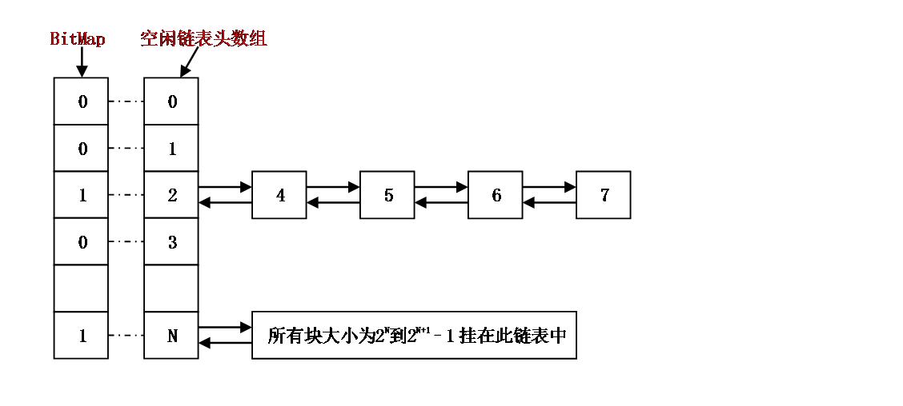
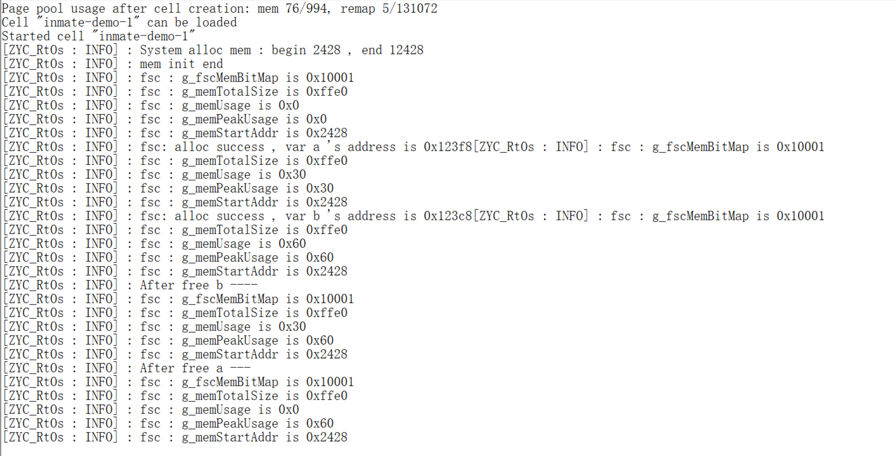

# 内存管理
ZYC_RtOs 为了动态分配内存，开辟了 OS_MEM_FSC_PT_SIZE bytes的内存区域供用户使用。

OS_MEM_FSC_PT_SIZE 可以任意指定，但是在 Jailhouse 环境下，不能设置为超过 inmate 分配的内存大小减去其余段的大小。

## 内存模块
```c
ZYC_RtOs
---ZYC_RtOs
------include
---------ZYC_mem.h
------mem
---------fsc
------------fsc_mem.h
------------fsc_mem.c
---------mem.h
---------mem_config.h
---------mem.c
```

## 内存 API
mem_init 函数用来初始化动态内存区域。

PRT_MemAlloc 和 PRT_MemAllocAlign 用来动态分配内存。

PRT_MemFree 用来动态释放内存。
```c
void mem_init(void);
extern void *PRT_MemAlloc(U32 mid, U8 ptNo, U32 size);
extern void *PRT_MemAllocAlign(U32 mid, U8 ptNo, U32 size, enum MemAlign alignPow);
extern U32 PRT_MemFree(U32 mid, void *addr);
```

## 内存管理机制
内存管理使用 fsc 算法。

内存管理主要工作是动态的划分并管理用户分配好的大片内存区间。当程序某一部分需要使用内存，可以通过操作系统的内存申请函数索取指定大小内存块，一旦使用完毕，通过内存释放函数归还所占用内存，使之可以重复使用。

### 核心思想
对于申请的内存大小为uwSize，如果用二进制，则表示为0b{0}1xxx，{0}表示1前面可能有0个或多个零。无论1后面xxx为何内容，如果将1变成10，xxx则全部变成0，则总会出现10yyy > 1xxx（此处yyy表示xxx的对应位全部变成0）。

我们可以直接得到最左边的1的下标。下标值或者从高位到低位依次为0-31（BitMap），或者从低位到高位依次为0-31（uwSize）。如果32位寄存器从高位到低位的bit位的下标依次为0-31，则0x80004000的最左边1的下标为0。于是我们可以维护一个空闲链表头数组（元素数不超过31），以内存块大小最左边的1的下标做为链表头的数组索引，即将所有最左边的1的下标相同的内存块挂接在同一个空闲链表中。



## 内存测试
测试用例：分配4字节变量 a 和 b，并释放 b 和 a 。

可以看出：分配 a 的地址是 0x123f8 ， b 是 0x123c8 。释放后， mem_usage 重新变为 0 。
